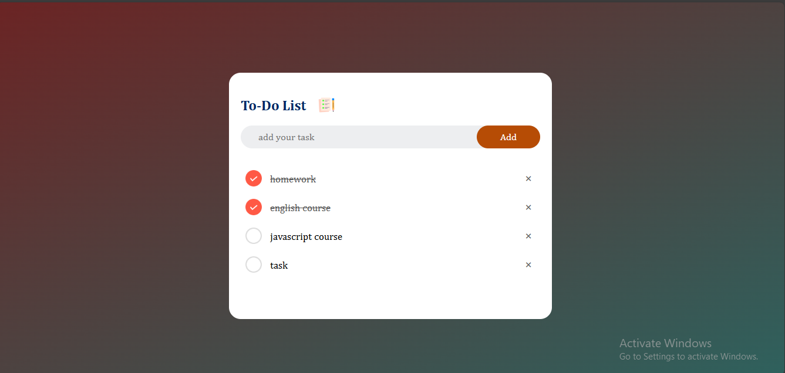

# ToDo List App

A simple and interactive To-Do List web application built with HTML, CSS, and JavaScript. This project allows users to add, edit, and delete tasks with ease.



## Features

- Add new tasks to your to-do list.
- Edit existing tasks.
- Mark tasks as completed or pending.
- Delete tasks from your list.
- Clean and user-friendly interface.


## Technologies Used

- **HTML**: The structure of the webpage.
- **CSS**: Styling and design of the app.
- **JavaScript**: Logic and interactivity to manage tasks.

## How to Run Locally

1. Clone the repository to your local machine:
   ```bash
   git clone https://github.com/Saqibi4213/branwaves-matrix-intern.git
